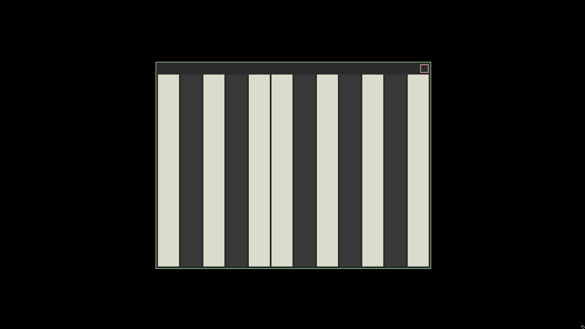

# Synth


A WIP synthesizer in C.

# Quick start
Depends on [SDL2](https://www.libsdl.org/index.php)

```console
$ git clone https://github.com/shoumodip/synth
$ cd synth
$ make
$ ./synth
```

# Usage
## Application
The application keybindings

| Key | Action                 |
| --- | ---------------------- |
| `q` | Quits the application  |
| `r` | Toggles recording mode |

## White Notes
White notes are played using the home row.

| Key | Note |
| --- | ---- |
| `a` | C    |
| `s` | D    |
| `d` | E    |
| `f` | F    |
| `j` | G    |
| `k` | A    |
| `l` | B    |

## Black Notes
Black notes are played using the top row.

| Key | Note |
| --- | ---- |
| `w` | C#   |
| `e` | D#   |
| `u` | F#   |
| `i` | G#   |
| `o` | A#   |

## Octaves
The octave is selected using the bottom row.

| Key | Octave |
| --- | ------ |
| `z` |      0 |
| `x` |      1 |
| `c` |      2 |
| `v` |      3 |
| `b` |      4 |
| `n` |      5 |
| `m` |      6 |
| `,` |      7 |
| `.` |      8 |
